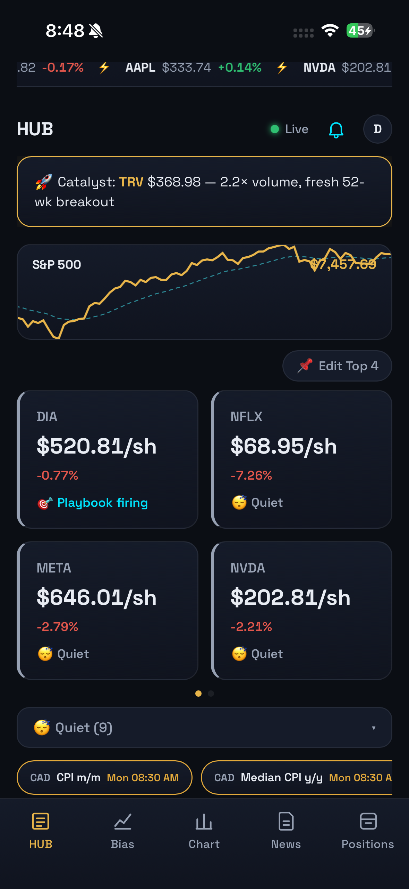
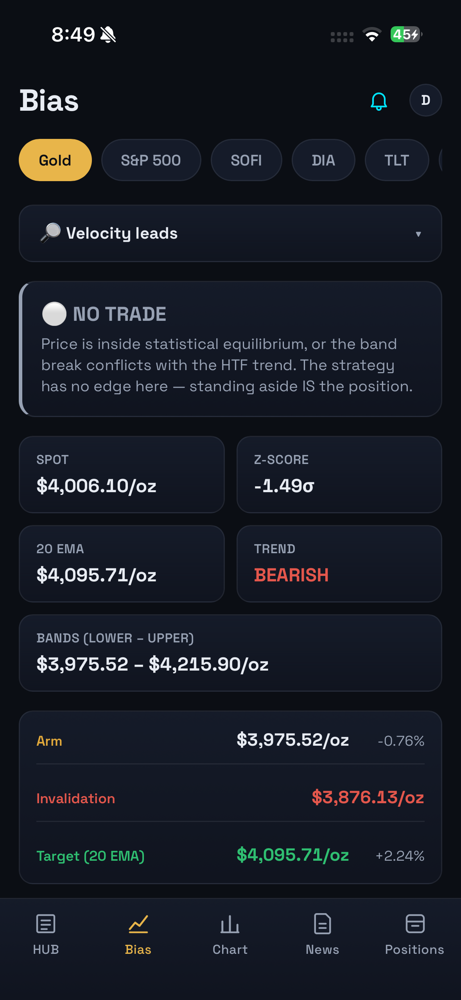
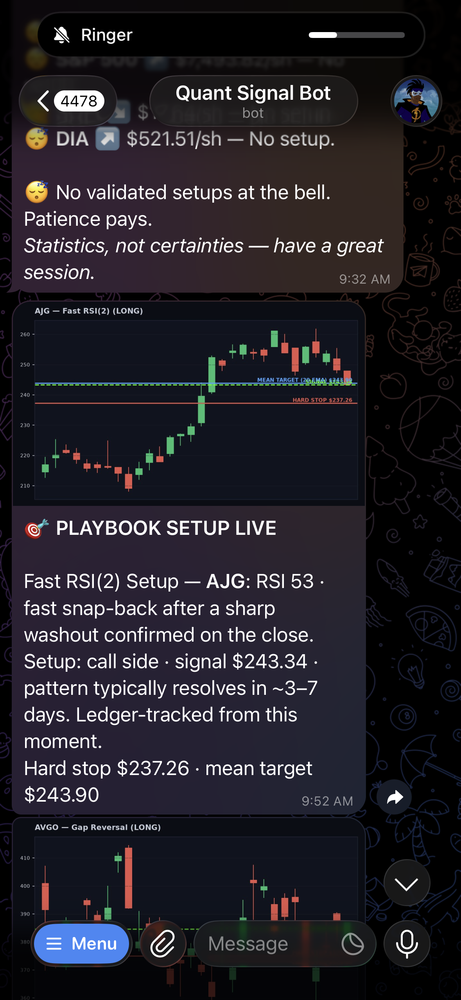

# N-CORE

A quant trading terminal I designed, built and deployed myself. It scans a 298-ticker universe, backtests and walk-forward validates strategy families per asset, and delivers live signals to a mobile web app and a Telegram bot.

**Author:** Daron Nyarko · Built June 2026 to present, with Claude Code

<p>
  
  
  
</p>
<p><em>Left to right: HUB, Bias, and the Telegram signal bot.</em></p>

## What it does

- **Bias and levels.** For each asset, the engine reports the current state, trend, entry level, invalidation and target, so I can see at a glance whether a setup is live.
- **Strategy lab.** Every strategy family is backtested and walk-forward validated per asset. Only pairs that pass validation get assigned to the playbook.
- **Screener.** Scans the full universe for candidates that match a validated setup.
- **Positions and journal.** Tracks open positions, real P&L and closed trades, with a "shield" that flags positions at risk ahead of earnings.
- **AI layer.** Claude reads market news for sentiment, answers plain-English questions about a setup, and writes market memos.
- **Alerts.** Push notifications in the app and a Telegram bot (`/bias sofi`, `/levels gold`, `/status`) that answers from engine math with no AI cost.

## How it's built

```
api/        FastAPI backend: 30+ JSON endpoints and the Telegram webhook
  main.py       routes
  analytics.py  strategy lab, walk-forward validation, playbook
  feed.py       market data feed (Yahoo Finance) with caching and rate-limit backoff
  screener.py   universe scan
  ai.py         Claude API calls for sentiment, Q&A and memos
  store.py      positions, watchlist and playbook persistence
  db.py         Supabase connection
web/        React + Vite mobile PWA (installable, push notifications, Supabase auth)
quant_core.py   strategy definitions and backtest engine
signal_engine.py  signal generation
db/         Supabase SQL schema and migrations
docs/       build briefs and screenshots
app.py      the original Streamlit dashboard (v1)
```

**Stack:** Python, FastAPI, Pandas, NumPy, React 19, Vite, lightweight-charts, Supabase (Postgres + auth), Claude API, Telegram Bot API, Railway.

## How I built it with Claude Code

I built N-CORE in phases. For each phase I wrote a brief that set the scope, the API contract between backend and frontend, what not to build yet, and a definition of done. Then I used Claude Code to implement it and reviewed the result before moving on. The briefs are in [`docs/claude-code-briefs/`](docs/claude-code-briefs/).

| Phase | What shipped |
|---|---|
| 1 | Quant core API and Telegram command bot |
| 2 | Mobile PWA with five tabs: HUB, Bias, Chart, News, Positions |
| 3–4 | AI tier (sentiment, Ask), alpha optimizer, trade validation, strategy lab |
| 5–6 | Automation, notifications, position entry, agent worker |
| 7–9 | Real P&L, journal, Supabase persistence, screener, signal ledger, earnings shield |
| 13–14 | Ninth strategy family, quiet mode, feed hardening, cluster-risk banner |

## Run it locally

Backend:

```
pip install -r requirements.txt
# .env: ANTHROPIC_API_KEY, plus Supabase and Telegram keys if you want those features
uvicorn api.main:app --reload --port 8000
```

Frontend:

```
cd web
cp .env.example .env   # set VITE_API_URL to http://localhost:8000
npm install
npm run dev
```

Original Streamlit dashboard: `streamlit run app.py`

## Where it started

N-CORE began as a Streamlit dashboard for gold. It pulled live prices, scored news sentiment, and had Claude write an investment memo on each load. Its mean-reversion engine used a 20 EMA baseline, ±2 standard deviation bands, a 200 EMA trend filter and a 2.5% stop. That logic became the first strategy family in N-CORE. The earlier static analysis is in [Gold-Market-Analysis](https://github.com/TechnicallyDaron/Gold-Market-Analysis).

*Not financial advice. This is a personal research tool.*
